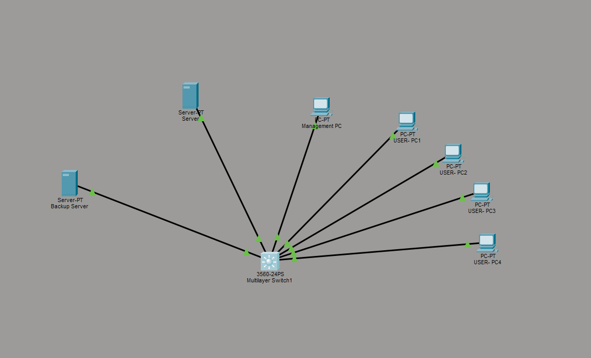
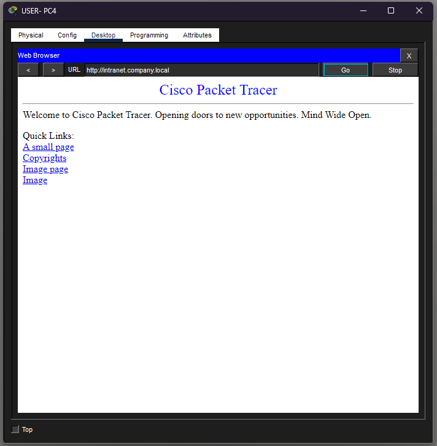

# Enterprise Data Center Network & Security Lab

A Cisco Packet Tracer lab designed to simulate a small enterprise/data-center network.

The project demonstrates network segmentation, Layer 3 routing, automatic client configuration, internal network services and access-control policies.

## Network Topology

## Technologies

- Cisco Packet Tracer
- Cisco IOS
- VLANs
- Layer 3 Switching
- Inter-VLAN Routing
- DHCP
- DNS
- HTTP
- Extended ACLs
- TCP/IP

## Network Design

| VLAN | Name | Network | Purpose |
|------|------|---------|---------|
| 10 | USERS | 192.168.10.0/24 | Employee devices |
| 20 | SERVERS | 192.168.20.0/24 | DNS and HTTP services |
| 30 | MANAGEMENT | 192.168.30.0/24 | Administrative systems |
| 40 | BACKUP | 192.168.40.0/24 | Backup infrastructure |

## DHCP

User devices receive IP addresses automatically from the Layer 3 switch.

The range 192.168.10.1–192.168.10.20 is reserved for static/infrastructure addresses.

## Internal Services

The server at:

192.168.20.10

provides:

- DNS
- HTTP
- Internal intranet

Users can access the internal website using:

http://intranet.company.local

## Network Security

Extended ACLs were implemented to enforce least-privilege access between VLANs.

### Access Policy

USERS → HTTP Server: ALLOW

USERS → DNS Server: ALLOW

USERS → MANAGEMENT: DENY

USERS → BACKUP: DENY

USERS → Other Server Traffic: DENY

MANAGEMENT → BACKUP: ALLOW

## ACL Verification

ACL match counters were used to verify that traffic was reaching the intended rules.

## Testing

The network was tested using:

- ping
- show vlan brief
- show ip dhcp binding
- show ip dhcp pool
- show access-lists
- Web browser HTTP testing
- DNS hostname resolution

## What I Learned

This project helped me develop practical experience with network segmentation, Layer 3 switching, DHCP, DNS and access control.

I also gained experience validating configuration changes by testing connectivity before and after implementing security policies.
