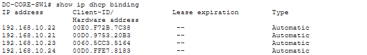
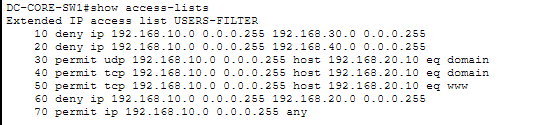

# Enterprise Data Center Network & Security Lab

A Cisco Packet Tracer project designed to simulate a small enterprise/data-center network.

The project demonstrates network segmentation, Layer 3 routing, automatic client configuration, internal network services, and access-control policies.

The goal was to build a network that not only provides connectivity, but also separates different types of infrastructure and restricts unnecessary access using least-privilege principles.

---

## Network Topology

The network is divided into four VLANs:

- **VLAN 10 — USERS**
- **VLAN 20 — SERVERS**
- **VLAN 30 — MANAGEMENT**
- **VLAN 40 — BACKUP**

A Cisco multilayer switch (`DC-CORE-SW1`) provides Layer 3 routing between the VLANs.

---

## Technologies & Concepts

- Cisco Packet Tracer
- Cisco IOS
- VLAN Segmentation
- Layer 3 Switching
- Inter-VLAN Routing
- DHCP
- DNS
- HTTP
- Extended Access Control Lists (ACLs)
- TCP/IP
- Static & Dynamic IP Addressing
- Network Troubleshooting

---

## Network Design

| VLAN | Name | Network | Purpose |
|------|------|---------|---------|
| 10 | USERS | `192.168.10.0/24` | Employee/client devices |
| 20 | SERVERS | `192.168.20.0/24` | Internal network services |
| 30 | MANAGEMENT | `192.168.30.0/24` | Administrative systems |
| 40 | BACKUP | `192.168.40.0/24` | Isolated backup infrastructure |

### Default Gateways

| VLAN | Gateway |
|------|---------|
| USERS | `192.168.10.1` |
| SERVERS | `192.168.20.1` |
| MANAGEMENT | `192.168.30.1` |
| BACKUP | `192.168.40.1` |

---

## DHCP Configuration

The USERS network uses DHCP so client devices can automatically receive their network configuration.

Infrastructure addresses from `192.168.10.1` to `192.168.10.20` are reserved, while DHCP dynamically assigns addresses above this range.

Example DHCP client:

`192.168.10.21`

The DHCP configuration provides clients with:

- IPv4 address
- Subnet mask
- Default gateway
- DNS server

DHCP leases were verified from the multilayer switch using:

`show ip dhcp binding`

---

## Internal DNS & Web Services

The server located in VLAN 20 uses the static address:

`192.168.20.10`

It provides:

- **DNS**
- **HTTP**
- **Internal intranet service**

A DNS A record was configured so users can access the internal website using:

`intranet.company.local`

instead of remembering the server's IP address.

This demonstrates communication between the USERS and SERVERS VLANs through the Layer 3 switch.

---

## Network Security

Extended Access Control Lists were configured on `DC-CORE-SW1` to restrict communication between VLANs.

The goal was to apply a **least-privilege access model**, allowing users to access required services while preventing access to sensitive infrastructure.

### Access Policy

| Source | Destination / Service | Result |
|--------|-----------------------|--------|
| USERS | DNS — UDP/53 | ✅ ALLOW |
| USERS | DNS — TCP/53 | ✅ ALLOW |
| USERS | HTTP — TCP/80 | ✅ ALLOW |
| USERS | MANAGEMENT VLAN | ❌ DENY |
| USERS | BACKUP VLAN | ❌ DENY |
| USERS | Other SERVER traffic | ❌ DENY |
| MANAGEMENT | BACKUP VLAN | ✅ ALLOW |

This means normal user devices can access the internal DNS and web services but cannot directly access management or backup infrastructure.

---

## ACL Verification

ACL traffic counters were used to verify that traffic was reaching the intended security rules.

The ACL was validated by testing traffic before and after implementing the security policy.

For example:

**Before ACL**

`USERS → MANAGEMENT = reachable`

**After ACL**

`USERS → MANAGEMENT = blocked`

Additional testing confirmed:

`USERS → BACKUP = blocked`

while:

`MANAGEMENT → BACKUP = allowed`

---

## Least-Privilege Server Access

Initially, USERS were able to communicate freely with the SERVER VLAN.

The ACL was then improved so USERS could access only the services they required:

- DNS — TCP/UDP port 53
- HTTP — TCP port 80

Other traffic from USERS to the SERVER VLAN was denied.

As a result:

`ping 192.168.20.10`

from a USERS device is blocked, while:

`http://intranet.company.local`

continues to work successfully.

This demonstrates service-level access control rather than simply allowing unrestricted communication between networks.

---

## Testing & Troubleshooting

The network was validated using Cisco IOS commands and client-side testing.

Commands used included:

`show vlan brief`

`show ip route`

`show ip dhcp binding`

`show ip dhcp pool`

`show access-lists`

`show running-config`

Client-side testing included:

- ICMP/ping connectivity testing
- DNS hostname resolution
- HTTP browser testing
- DHCP address assignment
- Inter-VLAN communication testing
- ACL allow/deny testing

ACL match counters were also used to confirm that traffic was being processed by the intended security rules.

---

## Project Files

The repository includes:

- The complete Cisco Packet Tracer `.pkt` project
- `DC-CORE-SW1` running configuration
- Network topology screenshot
- DHCP verification
- ACL verification
- Internal intranet demonstration

The Packet Tracer project can be opened directly in Cisco Packet Tracer to inspect and test the network configuration.

---

## What I Learned

This project gave me practical experience designing and troubleshooting a segmented enterprise network.

I developed hands-on experience with:

- Designing VLAN-based network segmentation
- Configuring Layer 3 inter-VLAN routing
- Implementing DHCP for client devices
- Configuring internal DNS and HTTP services
- Using static addressing for infrastructure
- Designing ACL-based security policies
- Applying least-privilege network access
- Testing configuration changes
- Troubleshooting network connectivity
- Using Cisco IOS verification commands

One of the main lessons from the project was the importance of testing both **connectivity and security**. A successful network is not simply one where every device can communicate, but one where required communication works while unnecessary access is restricted.
